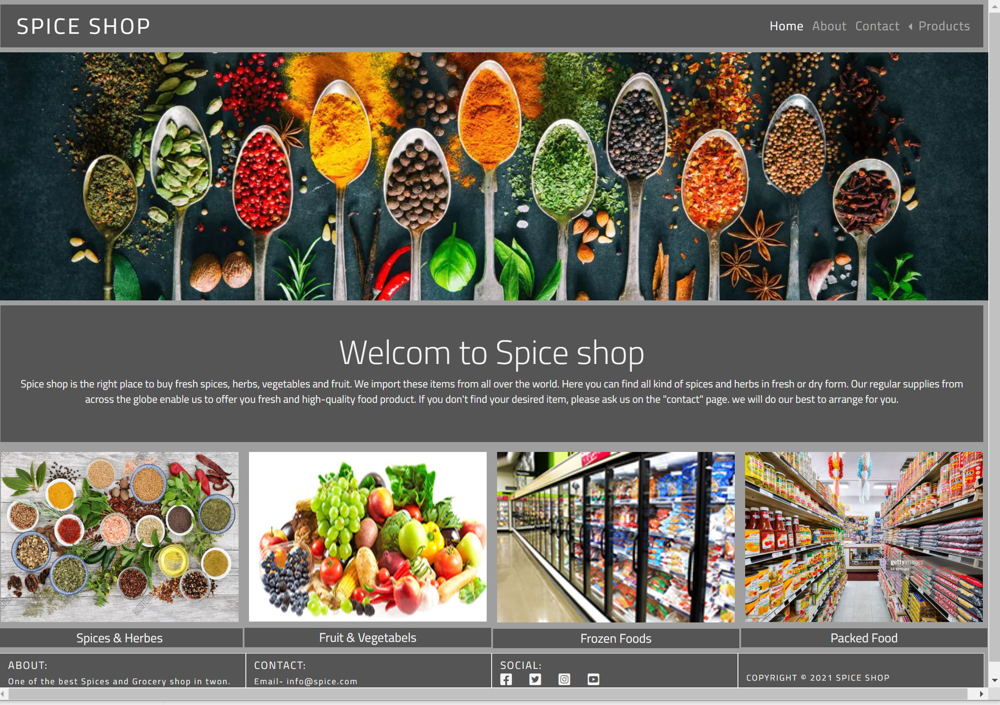
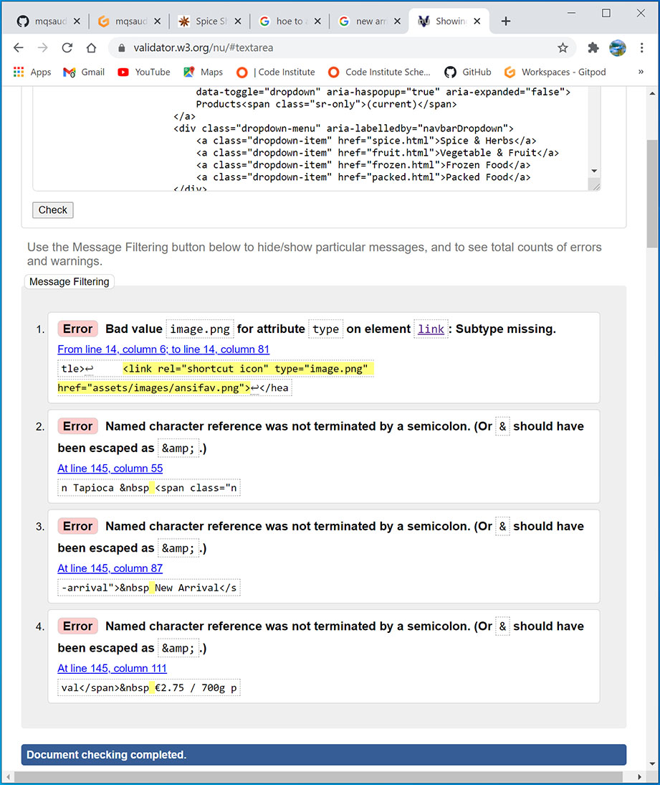
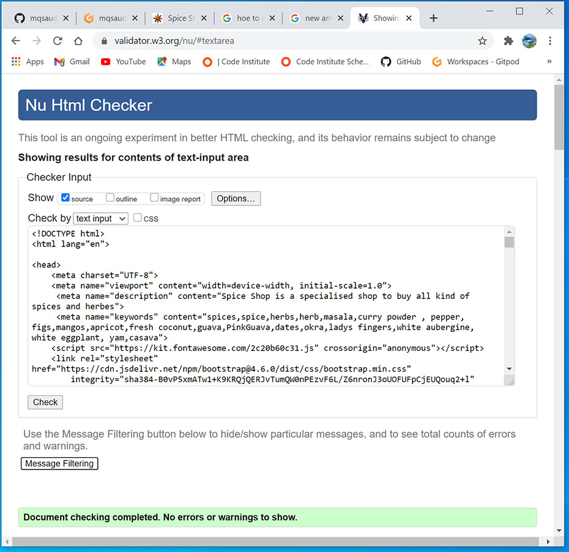
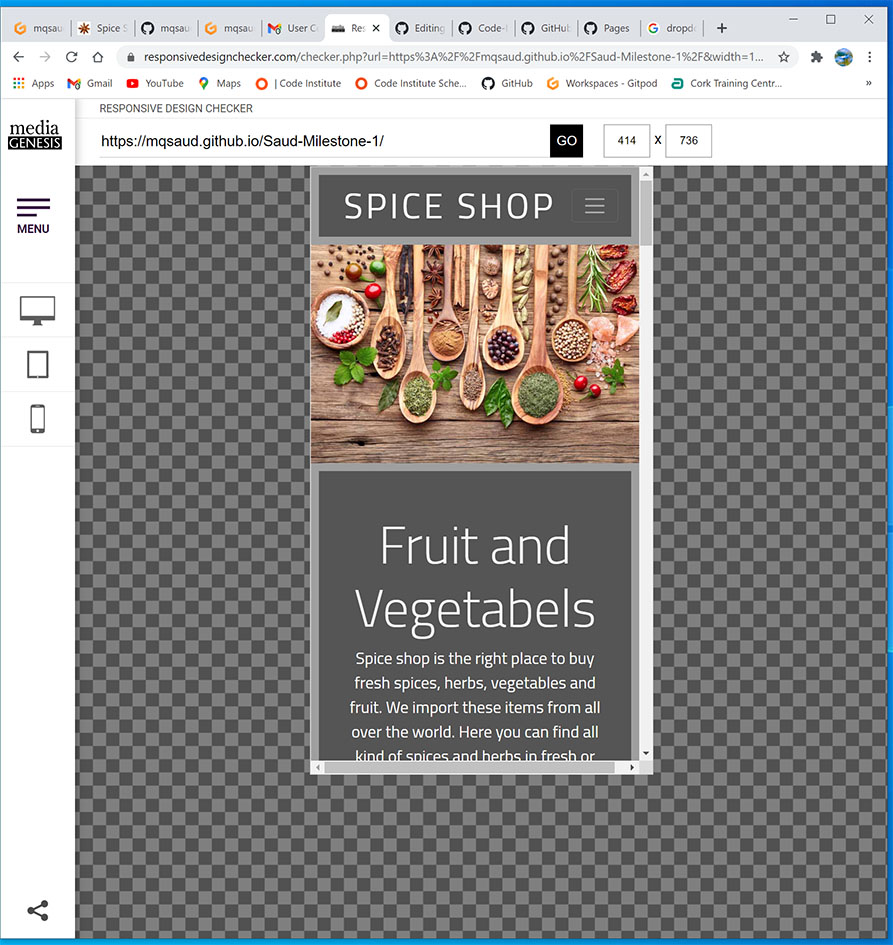
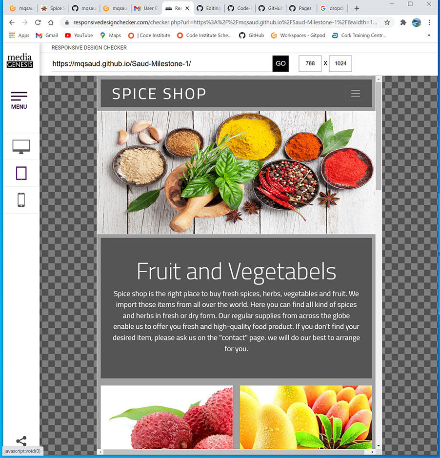
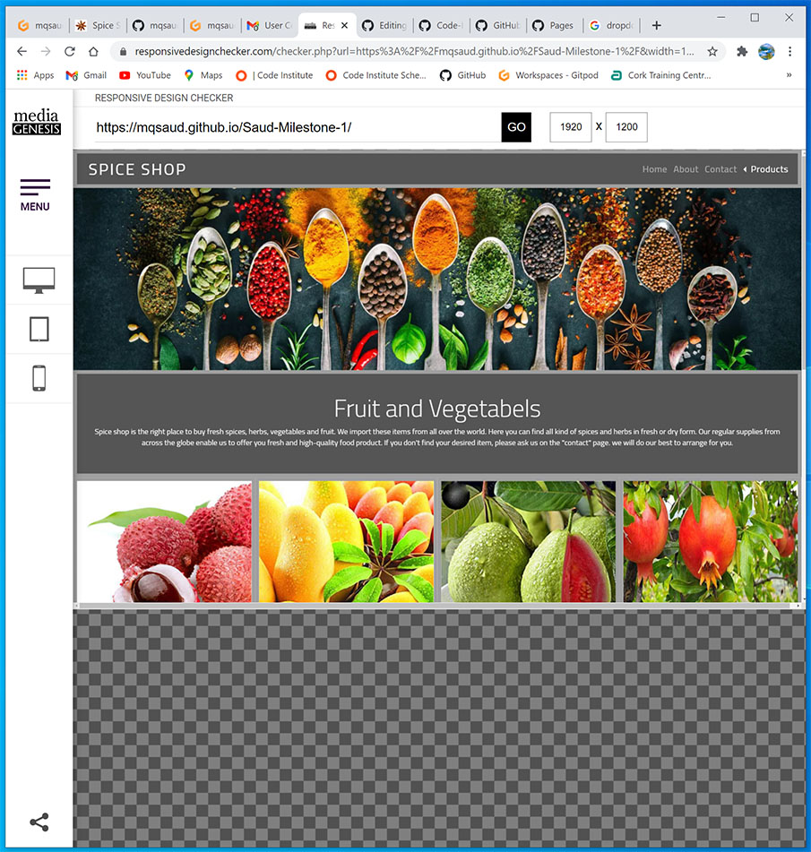

Welcome To My First Milestone project

# [SPICE SHOP](https://mqsaud.github.io/Saud-Milestone-1/)

  

## USER EXPERIENCE

This website is designed to promote the business of Spice Shop.

## Goal of Owner of the website.
1- Promote its business.  
2- Tell the customer what he/she sells and his product range.  
3- How coustomers can contact him.  
4- Encourge the customers to give feedback.

## Customers Attractions

Upon landing a customer on webpage,  
1- He can nevigate to the all pages of the website easily.  
2- Easily get informations about his/her desired product.  
3- Easily contact the to sale person through a messege, email or on telephone.

### User Stories 
  #### First Time Visitor Goal    
    a- As a first time visitor, I want to know what products are sold here.
    b- I want to be able to navigate around the different pages easily.
    c- I want to find the social media links to find out the reputation and fan following of the website.

  #### Returning Visitor Goal  
      a- As a returning visitor, I want to get more details about the product range and services.
      b- Is there any special offer?

  #### Frequent User Goal
       a- As a Frequent user, I want to know the upcoming sale and special offers.
       b- I want to know what product has newly arrived and what are their prices.    

## Design  
#### Color Scheme  
Multiple colors are used with white background.

#### Typography  
Following fonts are used.  
1-Sans-serif as a fallback font.  
2-Cario for main hedings.

#### Imagery  
A picture is worth than  thousand words. The website is furnished with many beautiful images specialy the hero image. All the product pages are furnished with many eye catching images related to product-page.

#### Wirefarme
 To view wirefarme please click [here](https://github.com/mqsaud/Saud-Milestone-1)

## Technology used

##### Languages
1-HTML5  
2-CSS3

#### Frameworks, Libraries and Programs 

1. [Bootstrap 4.6:](https://getbootstrap.com/docs/4.6/getting-started/introduction/)
    - Bootstrap was used to make the website responsive and stylish.  
1. [Balsamiq:](https://balsamiq.com/)
    - Balsamiq software was used to create the wirefarme images .
1. [Google Fonts:](https://fonts.google.com/)
    - From Google fonts Cario font was imported in style.css file.
1. [Font Awesome:](https://fontawesome.com/)
    - Font Awesome was used to download social media icons.
1. [Git](https://gitpod.io/)
    - Gitpod was used for version control by using the Gitpod terminal to commit to Git and Push to GitHub.
1. [GitHub:](https://github.com/)
    - GitHub plateform is used to store the project.
1. [Photoshop:](https://www.adobe.com/ie/products/photoshop.html)
    - Adobe Photoshop was used to resize and edit the images for the website.

## Test and vaidation 
All html file are validated with no errors by W3C vaidation service.  

During testing some has failed validation test.
  
After resolving the cause of validation failure, all file passed the validation test.

css file validated with no errors by using Jig saw validation service.

#### Testing User Stories from User Experience Section
- ##### First-time visitor Goal 
  * ###### a- As a first time visitor, I want to know what products are sold here.   
        1- When a user land on the website, a beautiful hero image welcomes the user.     
           Since the hero image is covered with spices, so user can easily understand 
           spices are sold here.  
        2- Below the hero image there are four more images that tell the user   
           fresh fruit and vegetables, frozen food and dry and packed food 
           is also sold here.
  * ###### b- I want to be able to navigate around the different pages easily.
        1- On the top landing page, there is a navigation bar that makes it easy to navigate around all the pages.
        2- The link the of active page become highlighted.  
  * ######  c- I want to find the social media links to find out the reputation and fan following               of the website.
        1- The social media link icons are available on the footer.
        2- when a user clicks on an icon, the related social media page opens in a new tab.  

- ##### Returning Visitor Goal
  * ######  a- As a returning visitor, I want to get more details about the product range and                 services.  
        1- There are four product pages. By visiting these pages, the user knows the product range. 
        2- In the welcome paragraph on landing page the shop offers a service to arrange the customer's desired spice if that spice is not available in Shop.  
  * ###### b- Is there any special offer?
         On every product page, information about the current offers are available.
- #### Frequent User Goal
  * ###### a- As a Frequent user, I want to know the upcoming sale and special offers.
         On the home page, information about upcoming special offers is available.
  * ###### b- I want to know what product has newly arrived and what are their prices. 
          On every product page, the newly arrived items are highlighted with the price.         
### Further Testing
 To test respnsiveness of the website [Responsivedesignchecker.com](https://responsivedesignchecker.com/) was used. Below are some testing screen shots.    
 
 
 

- ##### The Website is tested on following browsers Phone sets.
      Chrom. firefox, Edge and SeaMonkey
      Samsung A70, Nokia 7Plus, Huawei p30 lite and LG lg3.

- ##### Known Bugs
       1- On the home page and on all the product pages. The product link headings 
          (over the footer bar) are not properly aligned.
       2- Some time on 4K monitor, if the browser window is not fully opned, 
          then a white space below the footer bar can be seen.
       3- On some small phone sets the logo" Spice Shop" pushed to right side.            

  
## Deployment

### GitHub Pages

The project was deployed to GitHub Pages using the following steps...

1. Log in to GitHub and locate the [GitHub Repository](https://github.com/)
2. At the top of the Repository (not top of page), locate  the "Settings" Button on the menu.
3. Click on "Settings" button.
4. A setting page will appear with an "Option" dropdown menu on left side of the Setting heading.
5. Click on "Pages" at the bottom of this menu.  .
6. Under "Source", click the dropdown called "None" and select "Master".
7. Click on "Save" button.
8. The page will automatically refresh.
9. A message with your published site address will appear like,
" Your site is ready to be published at https://Account-Name.github.io/Repository-Name/"
6. Now the website is published at [GitHub](https://mqsaud.github.io/Saud-Milestone-1/) 

### Contents 
All cotents are written by me. 
 
### Media 
All pictures are taken from internet. 
 

### Acknowledgment
My mentor for his support and feedback. 
code Institute tutor support

